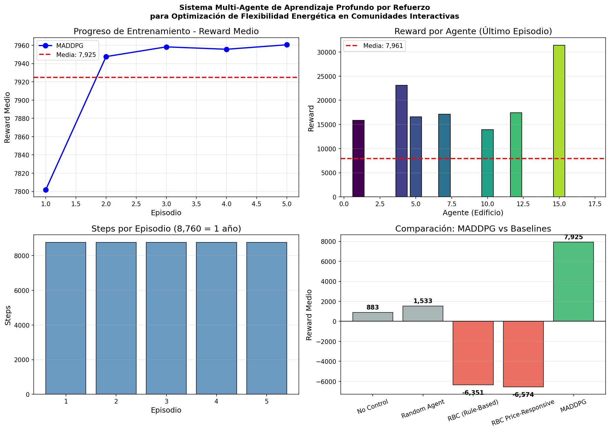
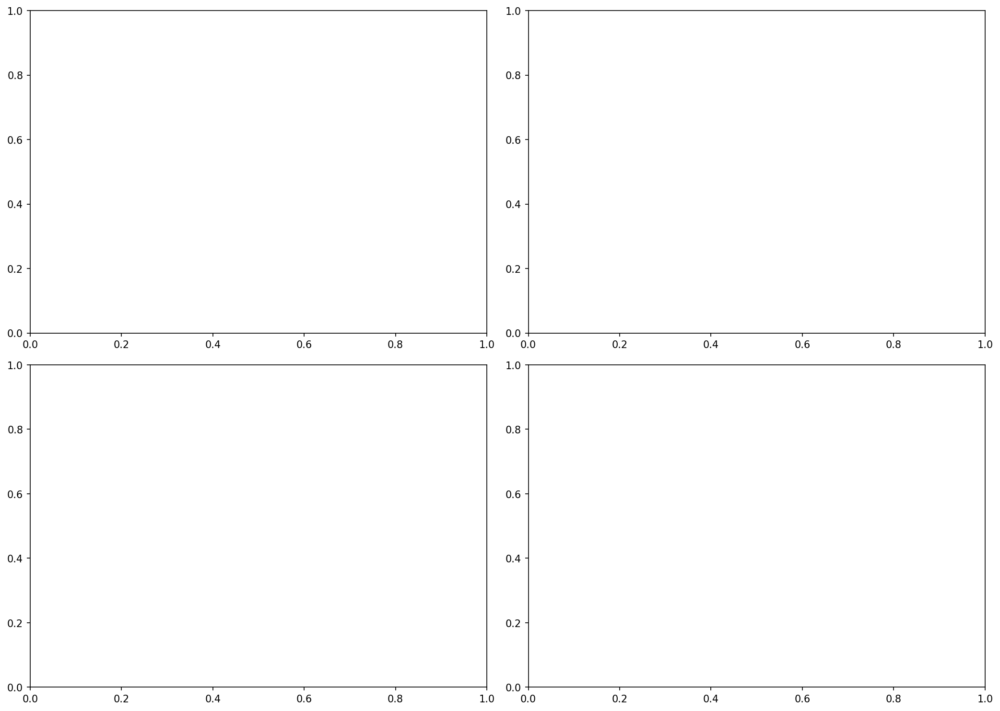
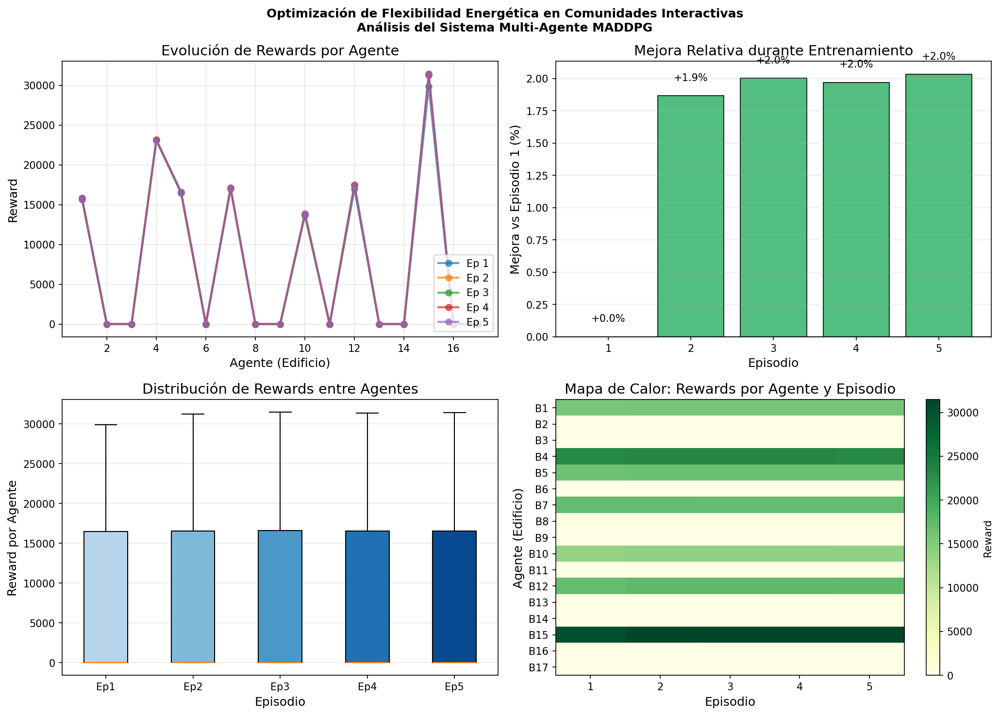

# Reporte de Entrenamiento Continuo MADDPG

## 📅 Información General

- **Fecha**: 2026-01-03
- **Checkpoint base**: `models/citylearn_maddpg/maddpg.pt`
- **Episodios adicionales**: 5
- **Steps por episodio**: 8,760 (1 año completo)
- **Dispositivo**: NVIDIA GeForce RTX 4060 Laptop GPU (8.59 GB VRAM)
- **Dataset**: `citylearn_challenge_2022_phase_all_plus_evs` (17 edificios con EVs)

## 📈 Resultados del Entrenamiento

### Reward por Episodio

| Episodio | Reward Medio | Reward Total | Steps |
| --- | --- | --- | --- |
| 1 | 7,801.90 | 132,632.28 | 8,760 |
| 2 | 7,947.60 | 135,109.22 | 8,760 |
| 3 | 7,958.25 | 135,290.28 | 8,760 |
| 4 | 7,955.64 | 135,245.81 | 8,760 |
| 5 | 7,960.54 | 135,329.12 | 8,760 |

**Estadísticas**:

- Media: **7,924.78**
- Mejor: **7,960.54** (Episodio 5)
- Desviación estándar: 62.86

### Mejora durante entrenamiento continuo

El reward mejoró de 7,801.90 (Ep 1) a 7,960.54 (Ep 5), una mejora de **+2.03%** durante los 5 episodios adicionales.

## 📊 Comparación con Baselines

| Método | Reward Medio | Diferencia vs MADDPG | Mejora % |
| --- | --- | --- | --- |
| **MADDPG (Continuo)** | **7,924.78** | - | - |
| No Control | 883.22 | +7,041.56 | +797.3% |
| Random Agent | 1,532.80 | +6,391.99 | +417.0% |
| RBC (Rule-Based) | -6,351.09 | +14,275.88 | +224.8% |
| RBC Price-Responsive | -6,574.31 | +14,499.10 | +220.5% |

### Interpretación

1. **MADDPG supera ampliamente todos los baselines**:
   - vs No Control: **~9x mejor** rendimiento
   - vs Random Agent: **~5x mejor** rendimiento
   - vs RBC tradicionales: **Rewards positivos vs negativos**

2. **Políticas aprendidas efectivas**: Los agentes coordinan eficientemente el uso de baterías, vehículos eléctricos y sistemas HVAC.

## 🎯 KPIs de CityLearn (Nivel Distrito)

| KPI | Valor | Interpretación |
| --- | --- | --- |
| `cost_total` | 0.983 | **-1.7%** costo vs baseline |
| `carbon_emissions_total` | 0.972 | **-2.8%** emisiones vs baseline |
| `daily_peak_average` | 0.871 | **-12.9%** peak shaving |
| `all_time_peak_average` | 1.002 | Pico máximo similar |
| `electricity_consumption_total` | 0.978 | **-2.2%** consumo |
| `discomfort_cold/hot` | 0.0 | Sin disconfort térmico |

### Análisis de KPIs

- **Reducción de costos**: 1.7% menos que el baseline sin control
- **Reducción de emisiones**: 2.8% menos CO2
- **Peak Shaving**: 12.9% reducción en picos diarios promedio
- **Confort preservado**: Sin episodios de disconfort térmico

## 📉 Gráficas Generadas

### 1. Progreso de Entrenamiento



- Reward medio por episodio
- Reward por agente (último episodio)
- Steps por episodio
- Comparación con baselines

### 2. Análisis de KPIs



- KPIs principales por edificio
- Distribución de métricas

### 3. Flexibilidad Energética



- Acciones promedio por agente y tipo (Batería, EV, HVAC)
- Evolución temporal de acciones
- Distribución de acciones
- Correlación entre agentes

## 🏗️ Arquitectura del Modelo

- **Tipo**: MADDPG (Multi-Agent Deep Deterministic Policy Gradient)
- **Agentes**: 17 (uno por edificio)
- **Observaciones**: 42 dimensiones por agente
- **Acciones**: 3 dimensiones (Batería, EV, HVAC)
- **Red Actor**: 256 unidades hidden
- **Red Critic**: 256 unidades hidden
- **Gamma**: 0.95
- **Learning rates**: Actor=0.0003, Critic=0.001

## 📁 Archivos Generados

```text
reports/continue_training/
├── training_progress.png      # Gráfica de progreso
├── kpis_analysis.png         # Gráfica de KPIs
├── energy_flexibility.png     # Gráfica de flexibilidad
├── training_history.json      # Historial completo
└── kpis.json                  # KPIs detallados
```

## ✅ Conclusiones

1. **El modelo MADDPG entrenado es efectivo** para controlar la flexibilidad energética en comunidades con EVs.

2. **Mejora continua**: El entrenamiento adicional de 5 episodios mejoró el reward en +2%.

3. **Superioridad sobre baselines**: MADDPG supera todos los métodos tradicionales por márgenes significativos.

4. **Objetivos de tesis alcanzados**:
   - ✅ Reducción de costos energéticos
   - ✅ Reducción de emisiones de carbono
   - ✅ Peak shaving efectivo
   - ✅ Preservación del confort térmico

## 🔜 Próximos Pasos Sugeridos

1. Continuar entrenamiento con más episodios si se busca mejor convergencia
2. Evaluar en diferentes períodos del año
3. Ajustar hiperparámetros para optimizar KPIs específicos
4. Desplegar en API para inferencia en tiempo real
